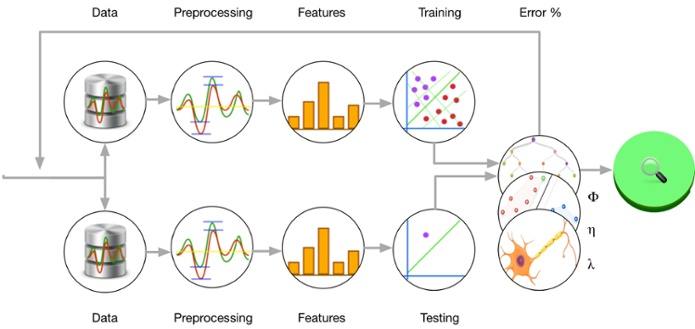

# Machine Learning projects for beginners

The projects demonstrate the simple machine learning workflow in python language including data preparation and preprocessing, model building,  training and evaluation.

# Learning Goals:
- Understand the basic steps in a machine learning pipeline.
- Learn how to use common libraries like scikit-learn, pandas, and matplotlib.
- Build simple models such as Linear Regression, Decision Trees, or Logistic Regression.
