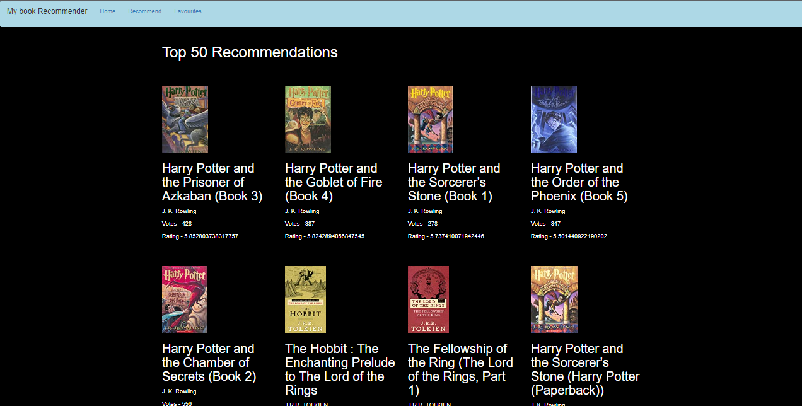
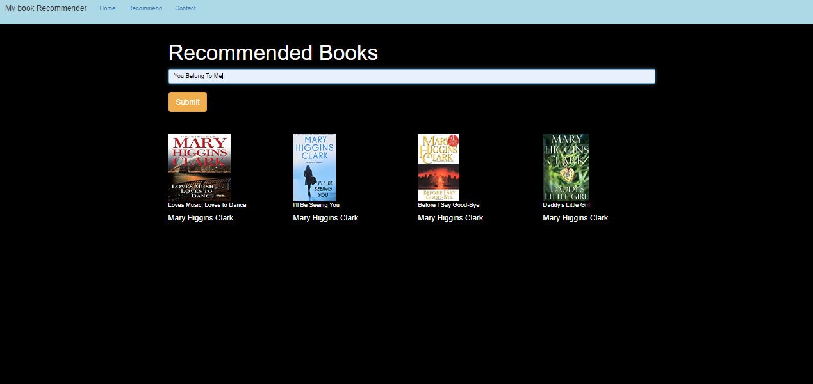
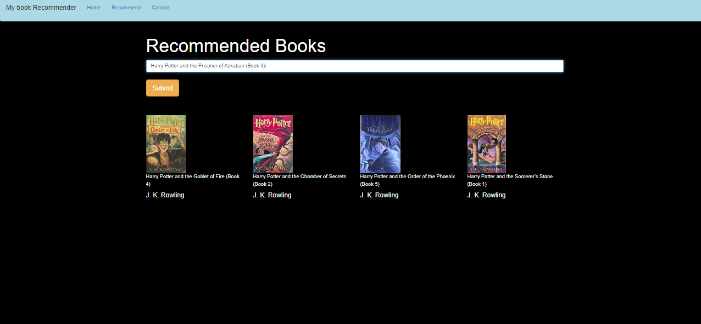

# **Books Recommendation System**

An end-to-end Books Recommendation System based on **User-based Collaborative Filtering** that delivers personalized book recommendations by identifying users with similar tastes and preferences.

## **Overview**

The purpose of this project is to help users discover books they are likely to enjoy by leveraging two recommendation strategies: **Popularity-based Filtering** and **Collaborative Filtering**. By combining these approaches, the system can offer diverse recommendations, either suggesting the most popular books or finding books based on the reading habits of similar users.

## **Collaborative Filtering Techniques**

Collaborative filtering is a widely-used recommendation approach, and there are two main types:

1. **User-based Collaborative Filtering**:
    - Measures the similarity between the target user and other users.
    - Recommendations are based on what similar users have liked or interacted with.
    - Example: "I might enjoy books my friends enjoy because we share similar tastes."

2. **Item-based Collaborative Filtering**:
    - Measures the similarity between items (books) based on user interactions.
    - Recommendations are based on items that are similar to books the user has enjoyed.
    - Example: "I might like a book that is similar to another book I've read and rated highly."

### **Core Idea**
The core idea behind collaborative filtering is to recommend items (in this case, books) that users with similar preferences have liked. It’s akin to the real-world scenario where you often enjoy what your friends, who share your taste, enjoy.

## **Project Details**

### **Dataset**
This project utilizes the **Books Review Dataset** from Kaggle’s [Book Recommendation Dataset](https://www.kaggle.com/datasets/arashnic/book-recommendation-dataset). The dataset contains millions of reviews, ratings, and other metadata, making it ideal for building robust recommendation systems.

### **Data Preprocessing**
Before creating the recommendation models, the data was preprocessed:
- **Duplicate Entries**: Removed to avoid bias in recommendations.
- **Null Values**: Handled by truncating or filling in essential missing data.
- **Feature Selection**: Only the most critical features, such as book titles, user ratings, and book metadata, were retained for model building.

### **Popularity-Based Recommendation System**
The **Popularity-Based System** works by displaying the top 50 books with the highest average ratings. Only books that have received more than 200 ratings are considered to ensure credibility. The average rating for each book is calculated, and the books are sorted in descending order, with the top 50 being presented to the user. This approach is ideal for users who are new to the platform or are looking for globally well-received books.

### **Collaborative Filtering System**
The **Collaborative-Based System** uses a similarity matrix to measure the correlation between books based on user interactions. It compares books to each other based on user ratings and generates personalized recommendations. When a user selects a book, the system finds four books that have the highest correlation with the chosen book and displays them as recommendations.

### **Model Training**
1. **User-Based Collaborative Filtering**: Identifies users with similar preferences and suggests books they liked.
2. **Item-Based Collaborative Filtering**: Recommends books similar to the ones the user has rated highly.
3. **Cosine Similarity**: Used to calculate the similarity between books and users, ensuring the system identifies the most relevant recommendations for the user.

### **Recommendation Output**
- **Popularity-Based**: Returns top 50 highest-rated books overall.
- **Collaborative Filtering**: Provides personalized book recommendations based on the similarity between books or users' preferences.

## **Live Demo**

This project has been deployed to Heroku, and you can experience it live. Simply follow the link below to explore the recommendation system:

[**Books Recommendation System on Heroku**](https://books-recommender-system-py.herokuapp.com/)

## **Results**

### **Popularity-Based System**
In the popularity-based recommendation system, books with the highest average ratings are displayed. This approach is useful for users seeking the most well-regarded books.

### **Collaborative-Based System**
In this approach, recommendations are based on similarity between books, where the system identifies books most similar to the user’s previous selections.

More insights from the collaborative filtering model, showing personalized recommendations:

## **Summary**
This Books Recommendation System showcases the power of collaborative filtering combined with a popularity-based approach to recommend books tailored to individual users. Whether you’re looking for top-rated books or personalized suggestions based on your reading habits, this system is designed to enhance your book discovery experience.

Feel free to explore the system and let it guide you to your next favorite book!

